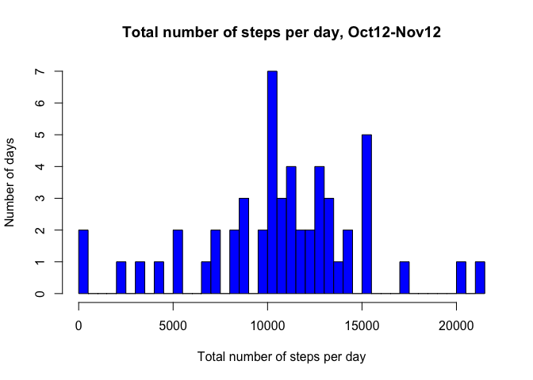
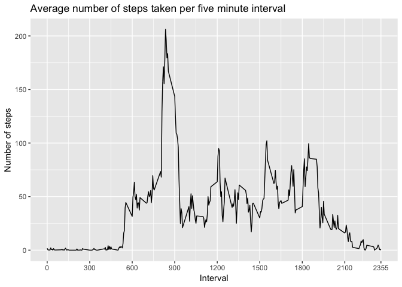
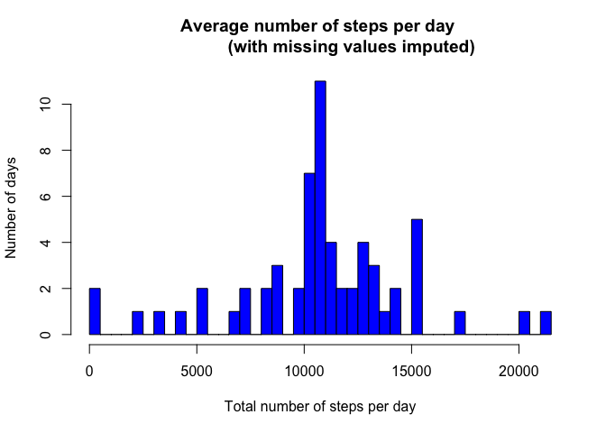
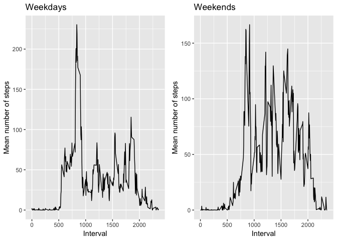

Reproducible Research Assignment 1
================

\#"Reproducible Research Assignment 1"
--------------------------------------

Loading and preprocessing the data
==================================

``` r
data<-read.csv("activity.csv", header=TRUE,sep=",", stringsAsFactors = FALSE)
data$date<-as.Date(data$date, "%Y-%m-%d")
```

What is the mean total number of days taken per day?
====================================================

In this part of the assignment I have ignored the missing values in the data set. The first part of the code calculates the mean number of steps per day using the group\_by function. The second part of the code shows the histogram. The third part of the code calculates and reports the mean and median of the total number of steps taken per day.

1. Calculate the total number of steps taken per day
----------------------------------------------------

``` r
library(dplyr)
```

    ## Warning: package 'dplyr' was built under R version 3.5.1

    ## 
    ## Attaching package: 'dplyr'

    ## The following objects are masked from 'package:stats':
    ## 
    ##     filter, lag

    ## The following objects are masked from 'package:base':
    ## 
    ##     intersect, setdiff, setequal, union

``` r
days<-group_by(data,date)
daysdf<-summarize(days, totsteps=sum(steps), na.rm=TRUE)
```

2. Make a histogram of the total number of steps taken each day
---------------------------------------------------------------

``` r
hist(daysdf$totsteps,breaks=61, 
     xlab="Total number of steps per day", ylab="Number of days",
             col="blue", main="Total number of steps per day, Oct12-Nov12")
```



3. Calculate and report the mean and median of the total number of steps taken each day
---------------------------------------------------------------------------------------

``` r
meansteps<-mean(daysdf$totsteps,na.rm=TRUE)
mediansteps<-median(daysdf$totsteps,na.rm=TRUE)
meansteps
```

    ## [1] 10766.19

``` r
mediansteps
```

    ## [1] 10765

What is the average daily pattern of activity?
==============================================

This chunk of code calculates the mean number of steps per 5 minute interval over the 61 days that the data covers. The first part of the code creates a data frame called 'intervals' and calculates the mean number of steps per interval. The second part of the code plots the chart using ggplot2.

Plotting the chart showing the mean number of steps per five minute interval
----------------------------------------------------------------------------

``` r
intervals<-group_by(data, interval)
intervalsdf<-summarize(intervals, meanactivity=mean(steps, na.rm=TRUE))

library(ggplot2)
chart2<-ggplot(intervalsdf, aes(interval, meanactivity))+geom_line()
chart2+scale_x_continuous("Interval", breaks=c(0,300,600,900,1200,1500,1800,2100,2355))+
        ylab("Number of steps")+ggtitle("Average number of steps taken per five minute interval")
```

 The average daily pattern of activity shows the number of steps peaking in the morning and then again later towards the end of the day

Which 5 minute interval, on average, contains the maximum number of steps?
--------------------------------------------------------------------------

``` r
maxsteps<-max(intervalsdf$meanactivity)
answer<-filter(intervalsdf, meanactivity==maxsteps)
answer
```

    ## # A tibble: 1 x 2
    ##   interval meanactivity
    ##      <int>        <dbl>
    ## 1      835         206.

The answer is 835

Imputing missing values
=======================

Calculate and report the total number of missing values in the data set
-----------------------------------------------------------------------

``` r
data$count<-is.na(data$steps)
sum(data$count)
```

    ## [1] 2304

Filling in the missing values
-----------------------------

My strategy for filling in the missing values is to take the mean for the relevant interval over the 2 month period. In the chunk of code below I: - split the original data set into two dataframes:the first data frame has missing data for the steps per 5 minute interval and the second contains data on steps - merge the missing df with the imputed values for the missing step data - create a new data frame called fulldata

``` r
missing<-subset(data, count==1)
nonmissing<-subset(data, count==0)
nonmissing<-select(nonmissing,-(count))

missing1<-merge(missing, intervalsdf,by="interval")

missing<-select(missing1, -(steps))
missing$steps<-missing$meanactivity
missing<-select(missing, -(meanactivity))

missing<-mutate(missing, steps1=steps)
missing<-mutate(missing, date1=date)
missing<-mutate(missing, interval1=interval)

missing<-select(missing, -(interval:count))
missing<-select(missing,-(steps1))

missing<-rename(missing, date=date1)
missing<-rename(missing, interval=interval1)

fulldata<-rbind(missing, nonmissing)
```

Make a histogram of the total number of steps taken each day
------------------------------------------------------------

The code below groups the data by date and then calculates total steps per day using the data frame with the imputed values. I then plot the chart and calculate the average total number of steps per day and media total number of steps per day

``` r
alldays<-group_by(fulldata,date)
alldaysdf<-summarize(alldays, alltotsteps=sum(steps))


chart3<-hist(alldaysdf$alltotsteps,breaks=61, col="blue", xlab="Total number of steps per day",
             ylab="Number of days",main="Average number of steps per day 
             (with missing values imputed)")
```



``` r
allmeansteps<-mean(alldaysdf$alltotsteps)
allmediansteps<-median(alldaysdf$alltotsteps)


allmeansteps<-mean(alldaysdf$alltotsteps)
allmediansteps<-median(alldaysdf$alltotsteps)
allmeansteps
```

    ## [1] 10766.19

``` r
allmediansteps
```

    ## [1] 10766.19

The median and mean total number of steps per dayare the same once the missing values are imputed.
The mean total number of steps per day with and without the missing values are the same. The median number of steps per day once the missing values are corrected for is slightly higher than that shown above. This is to be expected since adding observations to the data set will move the median upwards

Are there differences in activity patterns betwen weekdays and weekends?
========================================================================

Creating a new factor variable called weekend using the factor called weekdays.
-------------------------------------------------------------------------------

This takes the value of 0 if the day is a weekday and the value of 1 if the day is a weekend.

``` r
fulldata$workday<-weekdays(fulldata$date, abbreviate=FALSE)
workdaydf<-filter(fulldata, 
workday=="Monday"|workday=="Tuesday"|workday=="Wednesday"|workday=="Thursday"|workday=="Friday")
workdaydf$weekend<-0
weekenddf<-filter(fulldata,workday=="Saturday"|workday=="Sunday")
weekenddf$weekend<-1

intervals1<-group_by(workdaydf, interval)
intervalsworkdf<-summarize(intervals1, meanactivity=mean(steps))
intervalsworkdf$dummy<-0

intervals2<-group_by(weekenddf, interval)
intervalswedf<-summarize(intervals2, meanactivity=mean(steps))
intervalswedf$dummy<-1

newdata<-rbind(workdaydf,weekenddf)
newdata$weekend<-as.factor(newdata$weekend)
```

Plotting the final panel chart
------------------------------

The final chunk of code plots the panel charts showing the mean number of days for two groups - weekdays and for weekends. The charts show that the individual takes fewer steps at the weekend compared to on weekdays.

``` r
chart4<-ggplot(intervalsworkdf, aes(interval, meanactivity))+geom_line()
chart4pretty<-chart4+xlab("Interval")+ylab("Mean number of steps")+ggtitle("Weekdays")
chart5<-ggplot(intervalswedf, aes(interval, meanactivity))+geom_line()
chart5pretty<-chart5+xlab("Interval")+ylab("Mean number of steps")+ggtitle("Weekends")

library(gridExtra)
```

    ## 
    ## Attaching package: 'gridExtra'

    ## The following object is masked from 'package:dplyr':
    ## 
    ##     combine

``` r
grid.arrange(chart4pretty, chart5pretty, ncol=2)
```


